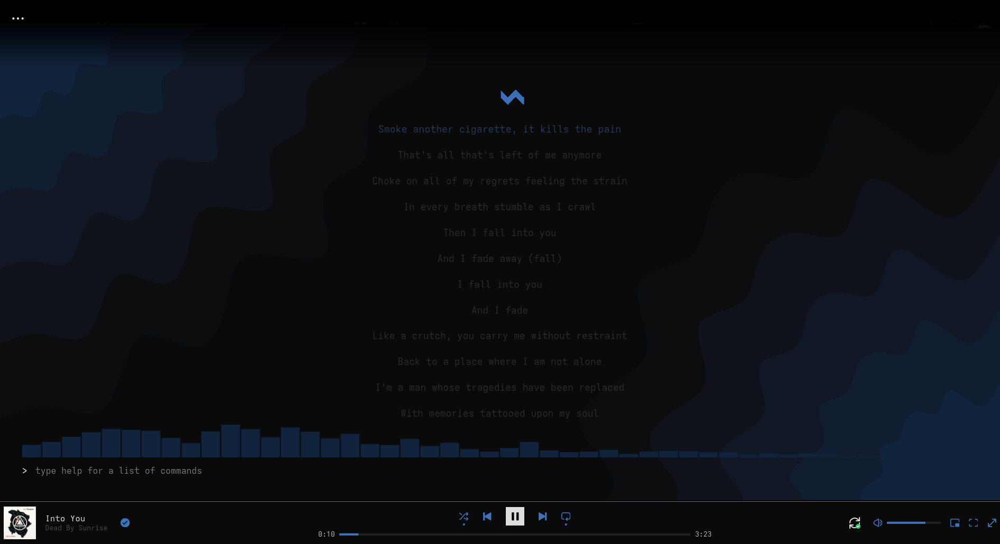
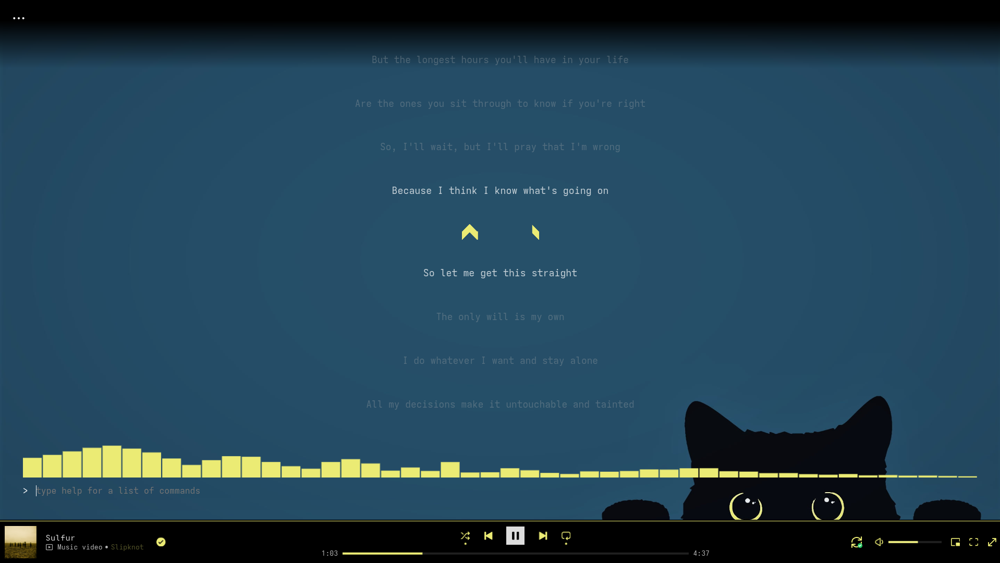

# My SpoTUI Themes

A collection of custom themes for [SpoTUI](https://github.com/SkenSMasteR/SpoTUI), a terminal-style Spicetify theme for Spotify.

## Themes

### Blue Waves

A dark blue theme with a wavy gradient wallpaper.

- **Theme file:** [`Blue-Waves/theme.json`](Blue-Waves/theme.json)
- **Wallpaper credit:** [D3Ext/aesthetic-wallpapers](https://github.com/D3Ext/aesthetic-wallpapers/blob/main/pages/Page2.md)

### Kitty

A beautiful black cat glaring at you with his big eyes.

- **Theme file:** [`Kitty/theme.json`](Kitty/theme.json)
- **Wallpaper credit:** [D3Ext/aesthetic-wallapapers](https://github.com/D3Ext/aesthetic-wallpapers/blob/main/pages/Page10.md)

## License

Wallpapers are credited to their original sources where known. Theme
configurations in this repo are free to use and adapt.
